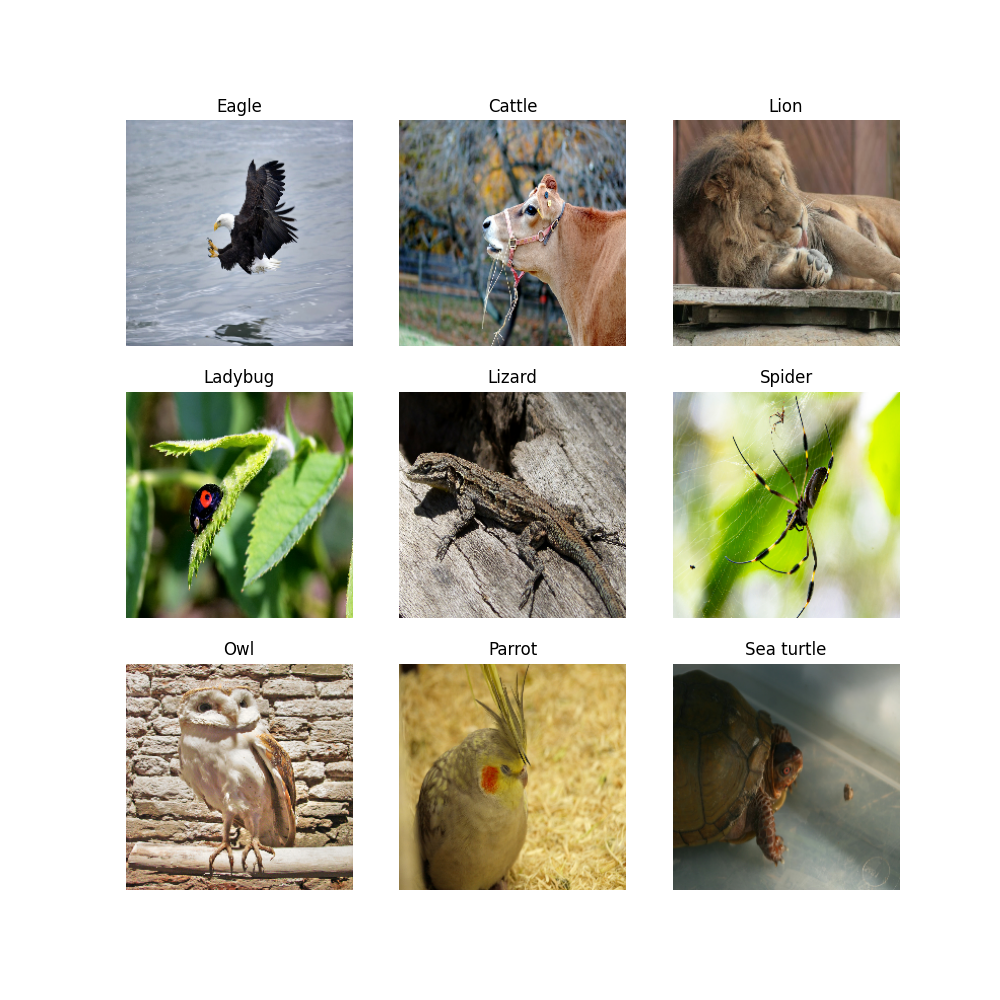
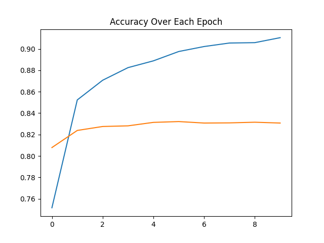
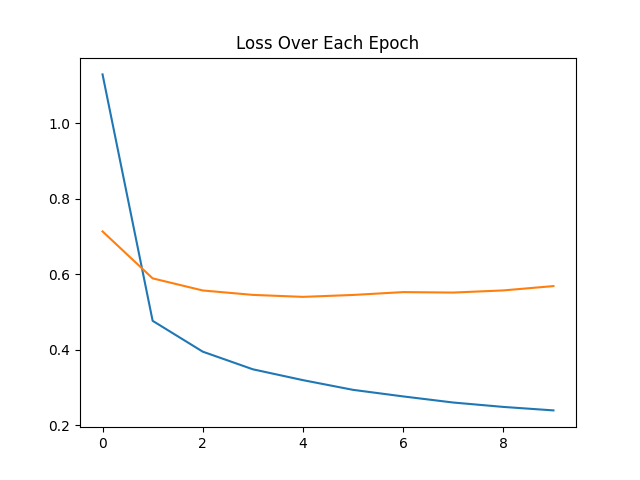

# 🐾 Animal Classifier

A deep learning image classification project that identifies animals from images using **transfer learning and fine-tuning** with a pretrained **EfficientNetB0** model.

The model is trained on the [Animals Detection Images Dataset](https://www.kaggle.com/datasets/antoreepjana/animals-detection-images-dataset) from Kaggle and supports **80 animal classes**.

## 📌 Project Overview

The goal of this project is to build an image classification model capable of recognizing different animals from input images.

Instead of training a CNN completely from scratch, this project uses a pretrained EfficientNetB0 model trained on ImageNet. The pretrained feature extractor is first used with frozen weights, followed by fine-tuning of the later layers on the animal dataset.

### Workflow

```text
Input Image
     ↓
Resize to 224 × 224
     ↓
Pretrained EfficientNetB0
     ↓
Global Average Pooling
     ↓
Dropout
     ↓
Dense Classification Layer
     ↓
Animal Class Prediction
```

## 📂 Project Structure

```text
animal_classifier/
│
├── figures/
│   ├── Sample_images.png
│   ├── accuracy.png
│   └── loss.png
│
├── models/
│   └── animal_classifier.h5
│
├── class_names.json
└── main.ipynb
```

## 🗃️ Dataset

**Dataset:** Animals Detection Images Dataset
**Source:** Kaggle
**Classes:** 80

The dataset is organized into separate training and testing directories, with each animal category represented by its own folder.

```text
animal/
├── train/
│   ├── Animal_1/
│   ├── Animal_2/
│   └── ...
│
└── test/
    ├── Animal_1/
    ├── Animal_2/
    └── ...
```

The class names used by the model are stored separately in `class_names.json`.

## 🧠 Model

### EfficientNetB0

The project uses **EfficientNetB0 pretrained on ImageNet** as the base model.

The training process follows two stages:

1. **Transfer learning**
   The pretrained EfficientNetB0 layers are frozen and a new classification head is trained for the 80 animal classes.

2. **Fine-tuning**
   Later layers of the pretrained network are unfrozen and trained with a smaller learning rate so the model can adapt its learned visual features to the animal dataset.

### Classification Head

The classification head consists of:

* Global Average Pooling
* Dropout
* Dense output layer
* Softmax activation

The final output contains one probability for each of the 80 animal classes.

## 🖼️ Sample Images

Examples from the dataset:



## 📈 Training Performance

### Accuracy

The training and validation accuracy curves are shown below:



### Loss

The training and validation loss curves are shown below:



## 💾 Saved Model

The trained model is available as:

`models/animal_classifier.h5`

The model can be loaded using TensorFlow/Keras:

```python
import tensorflow as tf

model = tf.keras.models.load_model(
    "models/animal_classifier.h5"
)
```

## 🏷️ Class Names

The model's class-to-index mapping is stored in:

`class_names.json`

```python
import json

with open("class_names.json", "r") as f:
    class_names = json.load(f)

print(class_names)
```

## 🔮 Making Predictions

After loading the model, an image can be resized and passed to the model for prediction:

```python
import numpy as np
from tensorflow.keras.utils import load_img, img_to_array

image = load_img("path/to/image.jpg", target_size=(224, 224))
image = img_to_array(image)
image = np.expand_dims(image, axis=0)

predictions = model.predict(image)

predicted_index = np.argmax(predictions[0])
predicted_class = class_names[predicted_index]
confidence = predictions[0][predicted_index]

print(f"Prediction: {predicted_class}")
print(f"Confidence: {confidence:.2%}")
```

## 🛠️ Technologies Used

* Python
* TensorFlow
* Keras
* EfficientNetB0
* NumPy
* Matplotlib
* Google Colab
* Jupyter Notebook

## 📓 Notebook

The complete training workflow is available in:

**[main.ipynb](main.ipynb)**

The notebook covers dataset loading, preprocessing, model creation, training, fine-tuning, evaluation, visualization, and model saving.

## 📚 Dataset Source

This project uses the **Animals Detection Images Dataset** available on Kaggle:

[Animals Detection Images Dataset – Kaggle](https://www.kaggle.com/datasets/antoreepjana/animals-detection-images-dataset)

## 👤 Author

**Deep Vejpara**
