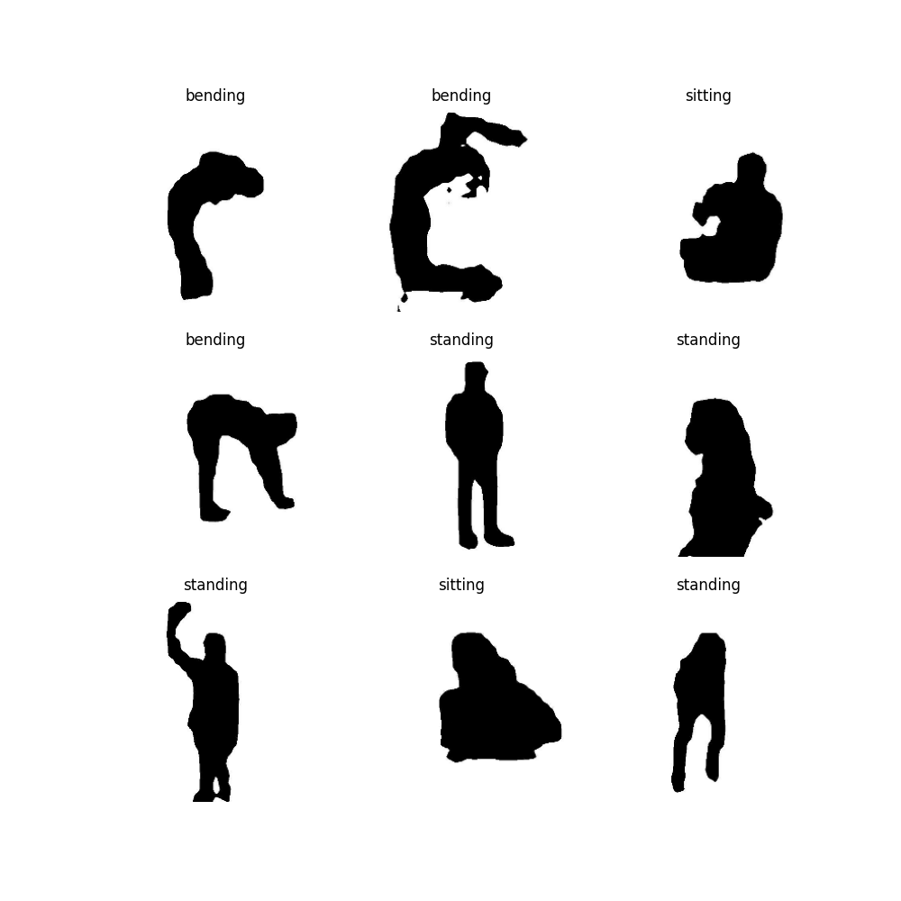

# 🧍 Human Posture Recognition

A deep learning project for classifying human body postures from silhouette images using **Transfer Learning with MobileNetV2**.

The model recognizes four different human postures:

* 🧎 **Bending**
* 🛌 **Lying**
* 🪑 **Sitting**
* 🧍 **Standing**

---

## 📌 Project Overview

Human posture recognition is a computer vision task where a deep learning model learns to identify different body positions from images.

In this project, a pretrained **MobileNetV2** model is adapted for human posture classification. The pretrained network is first used as a feature extractor, followed by fine-tuning of the later layers on the posture dataset.

### Workflow

```text
Posture Images
      ↓
Image Preprocessing
      ↓
Train / Validation Split
      ↓
Pretrained MobileNetV2
      ↓
Global Average Pooling
      ↓
Dropout
      ↓
Softmax Classification Layer
      ↓
Posture Prediction
```

---

## 📂 Dataset

The project uses the **Silhouettes for Human Posture Recognition** dataset from Kaggle.

**Dataset:** Silhouettes for Human Posture Recognition
**Dataset Creator:** mexwell
**Number of Images:** 4,800
**Number of Classes:** 4

### Classes

| Class      | Description                  |
| ---------- | ---------------------------- |
| `bending`  | Person in a bending posture  |
| `lying`    | Person in a lying posture    |
| `sitting`  | Person in a sitting posture  |
| `standing` | Person in a standing posture |

The dataset was split into:

* **80% training:** 3,840 images
* **20% validation:** 960 images

---

## 🧠 Model

The project uses **MobileNetV2 pretrained on ImageNet**.

### Transfer Learning

Initially, the pretrained MobileNetV2 layers were frozen and a new classification head was added for the four posture classes.

```text
MobileNetV2
     ↓
Global Average Pooling
     ↓
Dropout (0.3)
     ↓
Dense(4, Softmax)
```

### Fine-Tuning

After training the new classification head, the last 30 layers of MobileNetV2 were unfrozen and fine-tuned using a smaller learning rate.

```text
Learning Rate: 1e-5
Optimizer: Adam
Loss: Sparse Categorical Crossentropy
Activation: Softmax
```

---

## ⚙️ Training Configuration

| Parameter                 | Value                           |
| ------------------------- | ------------------------------- |
| Image Size                | 224 × 224                       |
| Batch Size                | 32                              |
| Training Images           | 3,840                           |
| Validation Images         | 960                             |
| Number of Classes         | 4                               |
| Base Model                | MobileNetV2                     |
| Pretrained Weights        | ImageNet                        |
| Optimizer                 | Adam                            |
| Initial Learning Rate     | 0.001                           |
| Fine-Tuning Learning Rate | 0.00001                         |
| Loss Function             | Sparse Categorical Crossentropy |
| Output Activation         | Softmax                         |

---

## 📊 Results

After fine-tuning MobileNetV2 for 10 epochs:

| Metric              |     Result |
| ------------------- | ---------: |
| Training Accuracy   | **92.50%** |
| Validation Accuracy | **90.83%** |
| Validation Loss     | **0.2522** |

The final model achieved approximately **90.8% validation accuracy** on the held-out validation set.

---

## 📈 Training Results

Training and validation performance are monitored throughout the training process.


---

## 🖼️ Sample Dataset Images

Examples from the posture dataset:



---

## 📁 Project Structure

```text
human_posture_recognition/
│
├── main.ipynb
├── posture_classifier.h5
├── class_names.json
│
└── figures/
    ├── Sample_images.png
    └── training_results.png
```

> The trained model and class mapping are included in the repository for inference.

---

## 💾 Model Files

### `posture_classifier.h5`

The trained MobileNetV2-based posture classification model.

### `class_names.json`

Contains the class labels used by the model:

```json
[
    "bending",
    "lying",
    "sitting",
    "standing"
]
```

Keeping the class names separately makes it possible to correctly map the model's output index to the corresponding posture.

---

## 🛠️ Technologies Used

* Python
* TensorFlow
* Keras
* MobileNetV2
* NumPy
* Matplotlib
* Google Colab
* Kaggle Dataset

---

## 🚀 Future Improvements

Possible improvements for this project include:

* Real-time posture recognition using a webcam
* Confusion matrix and per-class evaluation
* Precision, recall and F1-score analysis
* Real-time prediction confidence
* Posture monitoring over time
* Deployment using Streamlit
* Conversion to TensorFlow Lite for lightweight deployment

---

## 📚 What I Learned

Through this project, I practiced:

* Image classification
* Transfer learning
* Using pretrained CNN architectures
* Data loading with TensorFlow
* Training/validation splitting
* Data augmentation
* Fine-tuning pretrained models
* Multiclass classification with Softmax
* Model serialization
* Saving class labels separately from the model

---

## 👨‍💻 Author

**Deep Vejpara**

---

## ⭐ Project

This project is part of my **Deep Learning Projects** collection, where I experiment with different deep learning architectures, datasets, and computer vision applications.
